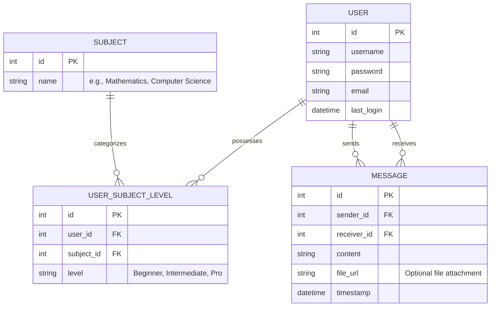
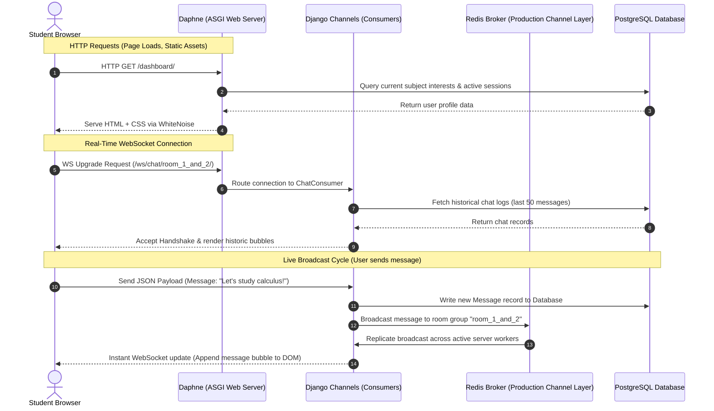

# Study Partner: Smart Peer-to-Peer Academic Collaboration Platform

Study Partner is a high-fidelity, real-time web application designed to connect students globally based on shared academic interests and complementary proficiency levels. Built on an asynchronous event-driven backend and highly responsive frontend aesthetics, the platform provides seamless chat communication, intelligent matchmaking, real-time message modification, and in-browser voice synthesis.

---

## 1. Executive Summary & Core Need

### The Academic Isolation Problem
Modern e-learning and standard remote studying often lead to cognitive blocks, isolation, and a rapid decline in motivation. Traditional discussion forums (e.g., Reddit, Discord, or StackOverflow) suffer from high latency, where a student posting a question might wait hours or days for an answer. Conversely, mainstream real-time chat platforms lack academic context, matching users randomly without regard for subject alignment or teaching-learning dynamics.

### The Study Partner Solution
Study Partner bridges this gap by introducing **Contextual Real-Time Peer Matching**. The platform operates on a simple, powerful philosophy: **collaboration is most effective when peers have complementary skill sets.** By tracking exactly what subjects a student is studying and their current self-assessed proficiency, the system acts as an automated, real-time academic matchmaker. It connects learners directly with mentors (Pros) and guides, creating an environment where one student reinforces their knowledge by teaching, while another accelerates their learning by receiving guidance.

---

## 2. Dynamic Matchmaking & Recommendation Logic

The core value proposition of Study Partner is its complementary recommendation engine. Instead of showing general users or basic randomized lists, the matching algorithm operates on strict, multi-layered constraints:

### Subject-Specific Filtering
Two users can only be recommended to each other if they share an interest in the **exact same subject** (e.g., Mathematics, Physics, Computer Science). This ensures that all opened communication channels are focused and academically relevant.

### Complementary Proficiency Matrix
The system recognizes three primary proficiency levels for each subject:
1.  **Beginner (Learner)**: Seeking fundamental guidance and step-by-step conceptual walkthroughs.
2.  **Intermediate (Practitioner)**: Solid grasp of fundamentals, seeking advanced problem-solving partnerships or reinforcing knowledge by guiding beginners.
3.  **Pro (Mentor)**: Mastery of the subject, seeking to mentor others, lead academic discussions, or collaborate on advanced projects.

To optimize the educational value of each connection, the matching engine maps relationships as follows:

| Logged-In User Level | Recommended Partner Level(s) | Collaboration Value |
| :--- | :--- | :--- |
| **Beginner** | **Intermediate**, **Pro** | The beginner is paired with someone capable of explaining complex formulas and concepts. |
| **Intermediate** | **Beginner**, **Pro** | The intermediate learns from the Pro while reinforcing their own skills by teaching the Beginner. |
| **Pro** | **Beginner**, **Intermediate** | The Pro acts as a mentor, cementing their mastery through active tutoring and peer leadership. |

#### Algorithm Implementation Flow
When a user accesses the dashboard:
1.  The backend checks the user's selected subjects and their respective levels.
2.  For each subject, the system queries the active database for other users who have registered interest in that same subject.
3.  It filters out users whose level matches the current user's level (e.g., a Beginner will never see another Beginner; a Pro will never see another Pro) to ensure there is an active learning/teaching differential.
4.  It presents these customized partners dynamically in the left sidebar under the "Recommended Partners" panel, updating instantly as users change their active subject levels.

---

## 3. Technology Stack Breakdown

Study Partner utilizes a state-of-the-art, asynchronous, and scalable technology stack designed for high throughput and rapid UI updates.

### Backend Infrastructure
*   **Django 5.2.x (Python)**: Acts as the primary backend command center. Provides a secure user authentication system, session managers, secure routing, and a built-in Object-Relational Mapper (ORM) for schema migrations.
*   **Django Channels 4.x**: Extends Django's synchronous core into an asynchronous, event-driven architecture. Channels intercepts incoming WebSocket upgrade handshakes and routes them to active consumer protocols.
*   **Daphne (ASGI Server)**: The production-grade Asynchronous Server Gateway Interface (ASGI) container. Daphne processes all HTTP and WebSocket connections concurrently under a single runtime loop.
*   **Redis Channel Layers (Production)**: Utilizing `channels_redis`, Redis acts as the multi-process broker. When multiple server instances are scaled on Render, Redis ensures that a WebSocket message sent to Server A is seamlessly broadcast to a user connected on Server B.
*   **InMemory Channel Layers (Local Development)**: Low-overhead, single-process in-memory channel routing, allowing developers to run the system offline without external dependencies.
*   **dj-database-url**: Parses production PostgreSQL environment variables dynamically into standard Django database configuration schemas.
*   **WhiteNoise**: High-performance static asset optimizer that sits directly in Django's middleware chain. WhiteNoise compresses, applies unique cache-busting hashes, and serves static files (CSS, JS, assets) with near-zero latency, avoiding expensive CDN integrations.

### Database Architecture
*   **Development**: SQLite3 (`db.sqlite3`) for quick, configuration-free, file-based schema modifications.
*   **Production**: PostgreSQL, providing ACID compliance, structured indexing, connection pooling, and automated backups.

### Frontend Engine
*   **Semantic HTML5**: Native elements structured for optimal search engine optimization (SEO), fast browser parsing, and structural accessibility.
*   **Custom Vanilla CSS3**: Uses HSL-tailored harmonious dark-mode palettes, smooth glassmorphism panels, interactive transitions, scrollbar customization, and keyframe micro-animations.
*   **Vanilla ES6+ JavaScript**: Native browser-level runtime that manages WebSocket streams, dynamically constructs HTML chat bubbles on-the-fly, processes file attachments, and direct DOM state manipulation.
*   **Web Speech Synthesis API**: Built-in, zero-latency browser voice engine. By utilizing `window.speechSynthesis`, textual messages are synthesized into spoken voice messages directly in the user's browser, completely eliminating the need for expensive third-party server-side audio processing, file storage, or bandwidth.

---

## 4. Database Models & Schema Relationships

The relational data structures are cleanly defined to keep data integrity high and queries highly optimized:

### Key Relationships
*   **`UserSubjectLevel`**: A junction model linking a `User` to a `Subject` with an associated `level` choice (`BEGINNER`, `INTERMEDIATE`, `PRO`). This allows a single user to be a "Pro" in Mathematics but a "Beginner" in Computer Science.
*   **`Message`**: Tracks direct peer-to-peer exchanges. Includes standard textual content, timestamps, and an optional attachment field (`file_url`) to support document sharing.

---

## 5. Granular Feature Implementations

Every interactive component of the Study Partner UI is engineered with strict attention to modern UX standards and real-time consistency.

### A. Real-Time WebSocket Messaging
*   **Routing**: The WebSocket route matches the pattern `/ws/chat/<room_name>/`. Rooms are dynamically and securely generated based on the ordered IDs of the two collaborating participants (e.g., `user_1_and_user_2`).
*   **Connection Lifecycle**: 
    1.  When a user selects a partner, JavaScript establishes a persistent `WebSocket` handshake.
    2.  `consumers.py` verifies the session, binds the connection to the specific room group, and loads message history.
    3.  When a message is typed, it is transmitted as a JSON packet containing the message string, file data (if any), and action type.
    4.  The consumer receives the packet, writes the record securely to the database, and broadcasts the structured payload to all connections in the room.

### B. Dynamic Voice Message Engine (Text-to-Speech)
To address accessibility and multi-modal learning, Study Partner incorporates an intelligent, client-side playback system:
*   **Audio Synthesis**: Every message bubble features a subtle speaker icon. Clicking the icon triggers a JavaScript routine that passes the message text to the browser's native `SpeechSynthesisUtterance` interface.
*   **Interactive Visual States**: The play button dynamically toggles states:
    *   *Idle*: Renders a standard "Play" volume speaker icon.
    *   *Playing*: Toggles into a red "Stop" square icon.
*   **State-Linked Controls**: If a user clicks a playing icon, the system stops the synthesis immediately, returning the icon back to the idle state. It handles active interrupts, ensuring that starting a new message automatically stops any prior playback to prevent audio overlap.

### C. Real-Time Clear Chat Functionality
To give users complete sovereignty over their data and privacy, the platform supports room-wide clear commands:
1.  Clicking the "Clear Chat" header button prompts a secure confirmation.
2.  Upon approval, a JSON action package `{ "action": "clear_chat" }` is sent via the active WebSocket.
3.  The backend consumer receives this command, executes a bulk delete query filtering messages by the current room's sender/receiver pairs, and broadcasts an instant clear command.
4.  The frontend client listeners on both screens intercept this broadcast and instantaneously purge the DOM message containers with smooth fade transitions, resetting the chat environment in real time.

### D. Specific Message Deletion
Users can delete individual messages from the history securely:
1.  Hovering over a message bubble reveals a contextual red trash-can deletion button (restricted exclusively to messages authored by the current logged-in user).
2.  Clicking delete transmits `{ "action": "delete_message", "message_id": <id> }` over the WebSocket.
3.  The consumer validates that the requesting user is the actual sender of that message to prevent malicious API tampering.
4.  Once authorized, the record is removed from the database, and a delete broadcast is dispatched.
5.  All connected clients in the room receive the broadcast and instantly remove that specific message bubble from their screens.

---

## 6. System Architecture & Information Flow

The overall request lifecycle for both HTTP pages and asynchronous WebSocket actions is mapped out below:

---

## 7. Production Deployment & DevOps Parameters

Study Partner is fully pre-configured for automated, containerized deployments on platforms like **Render**.

### Infrastructure-as-Code Configuration (`render.yaml`)
The project contains an integrated [render.yaml](file:///B:/study01/render.yaml) specification:
*   **Database**: Provisions a secure, managed PostgreSQL database.
*   **Web Service**: Provisions a Python container running the Daphne ASGI runtime on port `10000`.
*   **Redis Cache**: Provisions a secure, low-latency Redis service isolated from external networks to handle high-frequency WebSocket channel broadcasts.

### Key Deployment Variables
When deploying, configure these crucial variables in your Render environment settings:

| Key | Suggested Value | Purpose |
| :--- | :--- | :--- |
| `SECRET_KEY` | *Long, random alphanumeric string* | Cryptographic signing of cookies and forms. |
| `DEBUG` | `False` | Protects files and details by disabling standard tracebacks. |
| `ALLOWED_HOSTS` | `your-render-subdomain.onrender.com` | Restricts allowed request hosts for security. |
| `DATABASE_URL` | *Automatically injected by Render* | Connection URI linking your Django ORM to PostgreSQL. |
| `REDIS_URL` | *Automatically injected by Render* | Connection URI linking Daphne to the Redis Channel Layers broker. |

---

## 8. Platform Advantages & Key Highlights

1.  **Low-Latency Real-Time Sync**: No page refreshes are required. Match lists, messages, deletions, and chat wipes synchronize instantly across screens.
2.  **Ultra-Lightweight Voice Solution**: Uses standard client-side browser synthesis instead of server-side recording files, preserving massive database space, lowering network overhead, and providing instant audio generation.
3.  **Dynamic Skill Complementarity**: Eliminates traditional matchmaking friction by making sure students of matching experience levels are paired constructively to optimize teaching and learning dynamics.
4.  **Production-Ready Out of the Box**: Standardized configs are built directly into the codebase, allowing seamless transition from a single-file SQLite environment to a multi-instance PostgreSQL + Redis container on cloud platforms.
